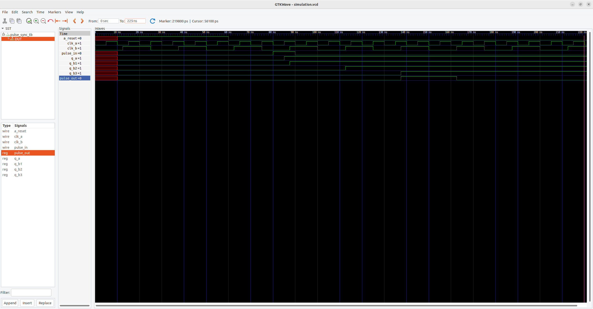

##Pulse Synchronizer
This project captures te design and verification process of a fast-to-slow clock-domain pulse synchronizer

##Features
- Asynchronous reset line
- 2 clock pins (fast and slow)
- an input line for the pulse input
- a 2 stage flip-flip synchronizer when the pulse crosses domains to handle metastable states
- pulse converter that converts a level signal to a single clock cycle wide pulse on the slower clock domain

##Directory Structure:
- rtl: houses the verilog file for the RTL design of the pulse synchronizer
- sim: simulation results and output waveform screenshot
- tb: testbench file for verifying functionality of the Pulse Synchronizer

##Tools Used
- RTL Simulation and Verification: iVerilog for compilation of rtl and tb files
- Waveform analysis: GTKWave

##How to simulate:
- pre-requisite: this assumes iVerilog and GTKWave have already been installed

- in the parent folder/directory, run this in terminal to compile the rtl and tb file:
	- iverilog -o sim/sim.out rtl/pulse_sync.v tb/pulse_sync_tb.v

- once this compiles without errors, execute this command to run the compiled code:
	- vvp sim/sim.out
	
- then to view the waveform:
	- gtkwave sim/simulation.vcd
	
##Waveform image:

